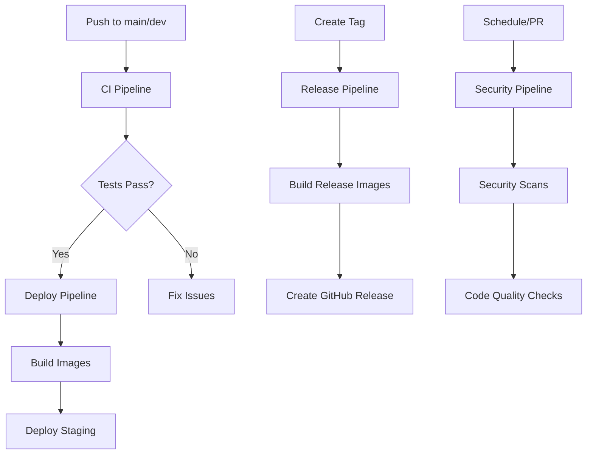

# GitHub Workflows Documentation

This document describes the CI/CD workflows for the Flight Insight application.

## Workflows Overview

### 1. CI Pipeline (`ci.yml`)
**Trigger:** Push to `main`/`dev` branches, Pull Requests
**Purpose:** Continuous Integration - testing and validation

#### Jobs:
- **backend-tests**: Tests the Node.js backend service with PostgreSQL
- **ml-service-tests**: Tests the Python ML service with database migrations
- **frontend-build**: Builds and tests the React frontend
- **notebooks-validation**: Validates Python notebook syntax
- **docker-builds**: Tests Docker builds for all services

#### Key Features:
- ✅ PostgreSQL service container for database tests
- ✅ pnpm package manager support
- ✅ Python ML service testing with Alembic migrations
- ✅ Multi-service Docker build validation
- ✅ Notebook syntax validation

### 2. Deploy Pipeline (`deploy.yml`)
**Trigger:** Push to `main` branch, Manual workflow dispatch
**Purpose:** Build and deploy Docker images

#### Jobs:
- **build-and-push**: Matrix build for all services (backend_dev, ml_service, frontend, web)
- **deploy-staging**: Deploys to staging environment
- **deploy-production**: Deploys to production (manual trigger only)

#### Key Features:
- ✅ Multi-architecture builds (linux/amd64, linux/arm64)
- ✅ Docker BuildKit caching
- ✅ Environment-specific deployments
- ✅ Rollback support on deployment failure
- ✅ Health checks

### 3. Security & Code Quality (`security.yml`)
**Trigger:** Push, Pull Requests, Weekly schedule
**Purpose:** Security scanning and code quality checks

#### Jobs:
- **dependency-check**: Trivy vulnerability scanning
- **python-security**: Safety & Bandit security checks
- **javascript-security**: npm/pnpm audit
- **docker-security**: Container image vulnerability scanning
- **code-quality**: Linting and formatting checks

#### Key Features:
- ✅ SARIF upload to GitHub Security tab
- ✅ Python security tools (Safety, Bandit)
- ✅ JavaScript dependency auditing
- ✅ Docker image security scanning
- ✅ Code formatting (Black, ESLint)
- ✅ Type checking (MyPy)

### 4. Release Pipeline (`release.yml`)
**Trigger:** Git tags (`v*.*.*`), Manual workflow dispatch
**Purpose:** Automated releases with versioned Docker images

#### Jobs:
- **create-release**: Creates GitHub release with changelog
- **build-release-images**: Builds versioned Docker images
- **update-deployment-configs**: Updates deployment configurations

#### Key Features:
- ✅ Semantic versioning support
- ✅ Automated changelog generation
- ✅ Multi-platform Docker builds
- ✅ Version tagging (latest, major.minor, major)
- ✅ Deployment config updates

## Required Secrets

Set these in your GitHub repository settings:

```
DOCKERHUB_USERNAME    # Your DockerHub username
DOCKERHUB_TOKEN       # DockerHub access token
```

## Environment Configuration

### Staging Environment
- Automatic deployment on `main` branch
- Health checks enabled
- Safe testing environment

### Production Environment
- Manual deployment only
- Requires approval
- Rollback on failure
- Enhanced monitoring

## Usage Examples

### Running Tests Locally
```bash
# Backend tests
cd backend_dev && pnpm test

# ML service tests
cd backend_dev/ml_service && python -m pytest

# Frontend tests
cd frontend && pnpm test

# Docker build test
docker-compose build
```

### Manual Deployment
```bash
# Trigger staging deployment
gh workflow run deploy.yml -f environment=staging

# Trigger production deployment  
gh workflow run deploy.yml -f environment=production
```

### Creating a Release
```bash
# Tag-based release
git tag v1.0.0
git push origin v1.0.0

# Manual release
gh workflow run release.yml -f version=v1.0.0
```

## Monitoring and Troubleshooting

### Common Issues:
1. **Docker build failures**: Check Dockerfile syntax and dependencies
2. **Test failures**: Review test logs and database connections
3. **Security failures**: Update dependencies or fix vulnerabilities
4. **Deployment failures**: Check health endpoints and rollback if needed

### Logs Access:
- GitHub Actions tab for workflow runs
- Docker logs for container issues
- Health check endpoints for service status

## Best Practices

1. **Always run tests locally** before pushing
2. **Keep dependencies updated** to avoid security issues
3. **Use feature branches** for development
4. **Tag releases** with semantic versioning
5. **Monitor security alerts** and act promptly
6. **Review deployment logs** after releases

## Workflow Dependencies



## Support

For workflow issues:
1. Check GitHub Actions logs
2. Review this documentation
3. Create an issue in the repository
4. Contact the development team
